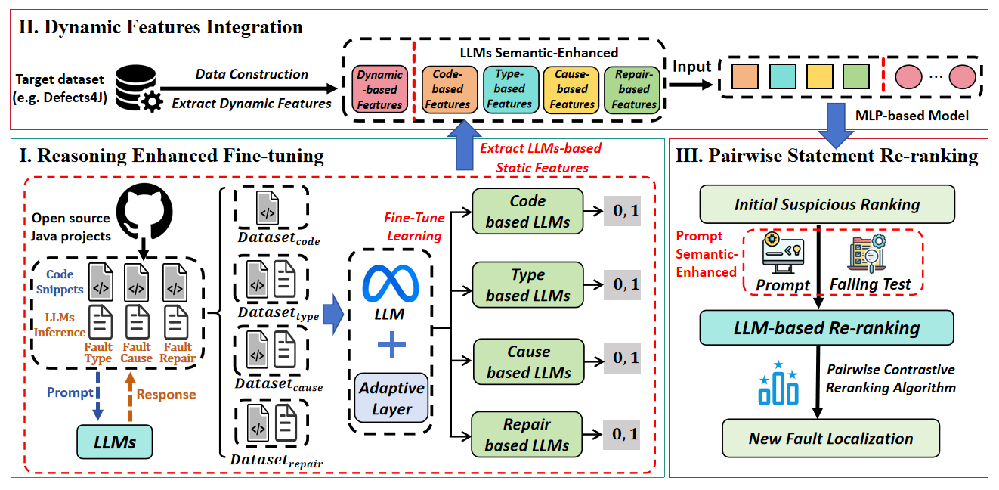

FaultScape: Multi-View Semantic Learning for Statement-Level Fault Localization

1. Overview of FaultScape

    

2. Download Dataset

    Click the following url link and download the necessary dataset used in this research.
    
    https://mega.nz/folder/HygxxJIQ#ESnCieZAgmCI1T4l4jxTRQ

3. Run FaultScape

    a. Reasoning Enhanced Fine -tuning:  run LLM_FL_Result\FL\LLM_fine_tune    four models to fine-tune LLMs and obtain the four LLMs semantic features.

    b. Dynamic Feature Integration:  run LLM_FL_Result\FL\run_FL_Result.sh    to combine the four LLMs semantic features and dynamic features, and obtain the MLP ranking results.

    c. Pairwise Statement Re -ranking:  run LLM_FL_Result\FL\pairwise_rerank\run_rerank.py    to re-rank the MLP ranking results.
